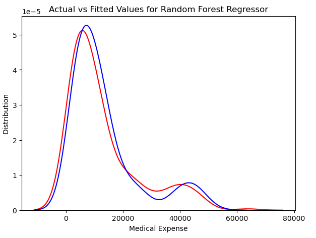

# 🏥 Medical Cost Prediction


A machine learning project predicting medical insurance costs using demographic and health factors.

## 📌 Table of Contents
- [Project Overview](#-project-overview)
- [Key Findings](#-key-findings)
- [Model Performance](#-model-performance)
- [Installation](#-installation)

## 📋 Project Overview
This project aims to predict medical expenses based on patients' demographic and health information using machine learning models. The dataset used is the Insurance dataset from Kaggle, containing 1338 observations with 7 variables
Predicts medical expenses using:
- **3 Regression Models**: Linear, Decision Tree, Random Forest
- **7 Key Features**: Age, BMI, Smoking Status, Region, etc.
- **Best Model**: Random Forest (R²: 0.863)

## Dataset Description
The dataset contains the following variables:
- `age`: Age of the patient
- `sex`: Gender of the patient (male/female)
- `bmi`: Body Mass Index
- `children`: Number of children/dependents
- `smoker`: Smoking status (yes/no)
- `region`: Residential area in the US
- `charges`: Medical expenses billed by health insurance (target variable)

## Data Preprocessing
- Converted categorical variables to numerical values:
  - `sex`: male → 1, female → 0
  - `smoker`: yes → 1, no → 0
  - `region`: southwest → 0, southeast → 1, northwest → 2, northeast → 3
- Checked for missing values (none found)
- Performed exploratory data analysis (EDA) with visualizations

## Exploratory Data Analysis
Key findings from EDA:
- Most patients are non-smokers (≈80%)
- BMI distribution follows a normal pattern
- Medical expenses are right-skewed, with most below $20,000
- Smokers have significantly higher medical expenses than non-smokers
- Male smokers outnumber female smokers


## 🔍 Key Findings


- Smokers pay **3-4x higher** medical costs
- BMI strongly correlates with charges (r=0.20)
- Age shows moderate correlation (r=0.30)


## 🚀 Model Performance
### Linear Regression

- **R²**: 0.783
- **MAE**: $4186

### Decision Tree

- **R²**: 0.725
- **MAE**: $2990

### Random Forest

- **R²**: 0.863
- **MAE**: $2524

## Future Improvements
- Implement feature engineering
- Try other regression models (XGBoost, SVM)
- Perform hyperparameter tuning
- Deploy as a web application

## 💻 Installation
```bash
git clone https://github.com/Darkvally46/Medical_Cost_Prediction.git
cd Medical_Cost_Prediction

